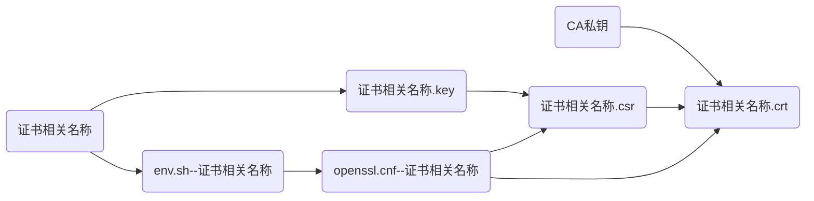
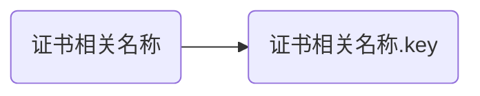
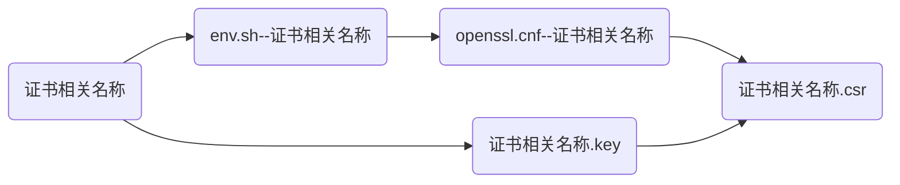
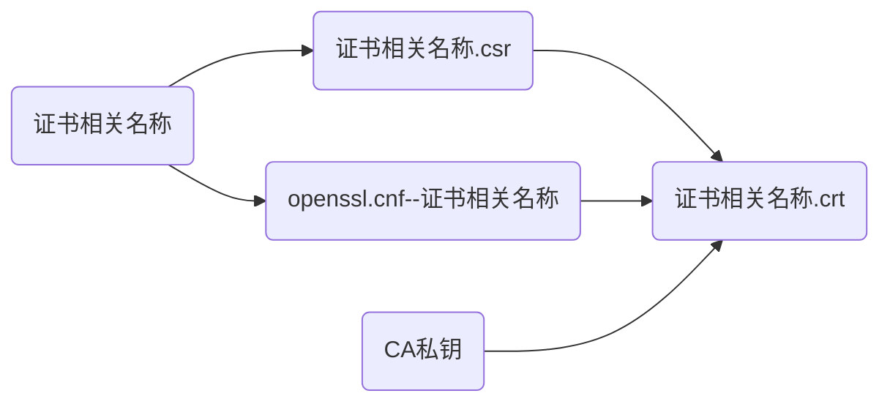
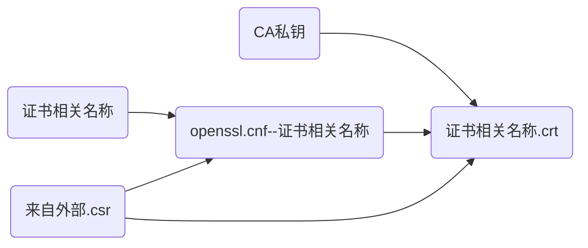

# zzxia-openssl-ca-server


[toc]


## 1 介绍

基于openssl的CA证书服务器。你可以用它搭建自己的专属CA服务器，以方便为用户生成私钥、证书请求、颁发证书、吊销证书、证书续期、证书吊销列表等。它可以生成多种类型的证书，包括且不限于web服务器、代码、计算机、客户端、信任列表、时间戳、IPSec、Email、智能卡登陆及其他OID证书。只需简单在配置文件中指定即可，证书完全兼容与Windows、Linux、Android、iOS等PC及手机系统（自签名不兼容）。项目是产品化的，不用修改代码就可以管理CA服务器整个生命周期，计划未来增加web操作页面，实现用户从网页端申请、下载、续期等证书操作，以及证书吊销列表的分发。


### 1.1 背景

由于现在https的盛行，我们经常需要在内网服务器、手机、PC上使用证书（内网域名没法使用免费的Letsencrypt证书），但多数时候大家只会生成自签名证书，不会以CA的方式颁发证书，更不会让用户安装CA证书，造成用户在使用过程中总是提示不安全，浪费时间且体验非常糟糕，再者，颁发证书的相关信息从来不保存，不具延续性，不是正经人的做法，哈哈哈哈哈哈哈哈哈！

另外：OpenSSL证书相关知识还是有点复杂的（虽然一般用的很简单），特别是一些概念，很多人搞不清用途与区别，所以生成较为复杂的证书就会走一些弯路（有别于简单的自签名证书），希望这个可以帮到你。也可以帮到我自己，免得要用的时候又得折腾，因为长时间不用，容易遗忘，算是知识的固化吧。


### 1.2 功能

1. 初始化CA服务器
2. 一步生成CA服务器私钥及证书
3. 一步生成用户私钥及证书
4. 分开步骤，分别为用户生成【私钥、证书请求、证书】
5. 为第三方证书请求颁发证书
6. 为证书续期
7. 吊销证书
8. 生成CA证书吊销列表


### 1.3 喜欢她，就满足她：

1. 【Star】她，让她看到你是爱她的；
2. 【Watching】她，时刻感知她的动态；
3. 【Fork】她，为她增加新功能，修Bug，让她更加卡哇伊；
4. 【Issue】她，告诉她有哪些小脾气，她会改的，手动小绵羊；
5. 【打赏】她，为她买jk；


## 2 软件架构

Linux shell


### 2.1 设计理念

- 用Openssl搭建CA服务器
- 信任环境：在CA服务器上为用户生成私钥与证书
- 非信任环境：用户自己生成私钥与证书请求，将证书请求给到CA服务器，CA服务器根据用户提供的证书请求文件为用户生成证书（私钥一般是需要保密的，把自己假想成了NB的公共证书颁发者了）


### 2.2 目录结构

> 初始化后的目录结构：

```bash
$ tree
.
├── 0-init_ca.sh
├── 1-generate_CA_key_and_crt.sh
├── blog-自建CA及证书颁发-old.md
├── crlnumber
├── function.sh
├── index.txt
├── key_usage.md
├── LICENSE
├── m-1-generate_user_key.sh
├── m-2-generate_user_csr.sh
├── m-3-generate_user_crt.sh
├── m-3in1-generate_user_key-csr-crt.sh
├── m-x-revoke_user_crt.sh
├── m-x-renew_user_crt.sh
├── m-x-generate_CA_crl.sh
├── my_conf
│   ├── env.sh--CA.sample
│   ├── env.sh--model
│   └── env.sh--test.lan
├── README.md
└── serial

1 directory, 17 files
```


## 3 安装教程

克隆到服务器上即可。
需要安装Linux 软件包`expect`。
在ubuntu上测试通过，理论上只要是基于Linux内核都行


## 4 使用说明

所有脚本都提供了`$0 -h|--help`参数，查看帮助即可。


### 4.1 搭建CA

1. 运行`./0-init_ca.sh -y`进行初始化
2. 基于`./my_conf/env.sh--CA.sample`创建`./my_conf/env.sh--CA`CA的环境变量文件
3. 运行`1-generate_CA_key_and_crt.sh -y`以生成CA服务器私钥与自签名证书
> 以上根据自己的信息填写即可


### 4.2 日常使用（为用户生成私钥、证书请求、证书）

> 运行脚本前，请先查看帮助，帮助中有相关脚本的依赖文件、参数说明及示例！
> 多数脚本须依赖基于`./my_conf/env.sh--model`创建的`./my_conf/env.sh--证书相关名称`环境变量文件，仓库中提供了一个示例（test.lan）`./my_conf/env.sh--test.lan`供参考。


#### 4.2.1 一步为用户生成私钥、证书请求、证书

>程序流程图：



>帮助：

```bash
$ ./m-3in1-generate_user_key-csr-crt.sh -h

    用途：用于生成用户秘钥与证书
    依赖：
        ./function.sh
        ./my_conf/env.sh--${NAME}      #--- 此文件须自行基于【./my_conf/env.sh--model】创建
    注意：
    用法:
        ./m-3in1-generate_user_key-csr-crt.sh  [-h|--help]
        ./m-3in1-generate_user_key-csr-crt.sh  [-n|--name {证书名称}]  <-p|--privatekey-bits {私钥长度}>  <-c|--cert-bits {证书长度}>  <-d|--days {证书有效天数}>  <-q|--quiet>
    参数说明：
        $0   : 代表脚本本身
        []   : 代表是必选项
        <>   : 代表是可选项
        |    : 代表左右选其一
        {}   : 代表参数值，请替换为具体参数值
        %    : 代表通配符，非精确值，可以被包含
        #
        -h|--help      此帮助
        -n|--name      指定名称，用以确定用户证书相关名称前缀及env、cnf文件名称后缀。
                       即：【私钥、证书请求、证书】的文件名称前缀：test.com.key、test.com.csr、test.com.crt
                           【环境变量、配置】文件名的后缀：env.sh--test.com、openssl.cnf--test.com
        -p|--privatekey-bits  私钥长度，默认2048
        -c|--cert-bits 证书长度，默认2048
        -d|--days      证书有效期，默认365天
        -q|--quiet     静默方式运行
    示例:
        ./m-3in1-generate_user_key-csr-crt.sh  -n test.com
        #
        ./m-3in1-generate_user_key-csr-crt.sh  -n test.com  -d 730
        ./m-3in1-generate_user_key-csr-crt.sh  -n test.com  -p 4096
        ./m-3in1-generate_user_key-csr-crt.sh  -n test.com  -p 4096  -c 2048  -d 730
        ./m-3in1-generate_user_key-csr-crt.sh  -n test.com  -q
```


#### 4.2.2 分步骤为用户生成私钥、证书请求、证书

1. 生成私钥：

>程序流程图：



>帮助：

```bash
$ ./m-1-generate_user_key.sh -h

    用途：用于生成用户秘钥
    依赖：
        ./function.sh
    注意：
    用法:
        ./m-1-generate_user_key.sh  [-h|--help]
        ./m-1-generate_user_key.sh  [-n|--name {证书相关名称}]  <-p|--privatekey-bits {私钥长度}>  <-q|--quiet>
    参数说明：
        $0   : 代表脚本本身
        []   : 代表是必选项
        <>   : 代表是可选项
        |    : 代表左右选其一
        {}   : 代表参数值，请替换为具体参数值
        %    : 代表通配符，非精确值，可以被包含
        #
        -h|--help      此帮助
        -n|--name      指定名称，用以确定用户证书相关名称前缀及env、cnf文件名称后缀。
                       即：【私钥、证书请求、证书】的文件名称前缀：test.com.key、test.com.csr、test.com.crt
                           【环境变量、配置】文件名的后缀：env.sh--test.com、openssl.cnf--test.com
        -p|--privatekey-bits  私钥长度，默认2048
        -q|--quiet     静默方式运行
    示例:
        ./m-1-generate_user_key.sh  -n test.com
        ./m-1-generate_user_key.sh  -p 4096  -n test.com
        ./m-1-generate_user_key.sh  -q  -n test.com
```

2. 生成证书请求：

>程序流程图：



>帮助：

```bash
$ ./m-2-generate_user_csr.sh -h

    用途：用于生成用户证书请求
    依赖：
        ./function.sh
        ./my_conf/env.sh--${NAME}      #--- 此文件须自行基于【./my_conf/env.sh--model】创建
    注意：
    用法:
        ./m-2-generate_user_csr.sh  [-h|--help]
        ./m-2-generate_user_csr.sh  [-n|--name {证书相关名称}]  <-q|--quiet>
    参数说明：
        $0   : 代表脚本本身
        []   : 代表是必选项
        <>   : 代表是可选项
        |    : 代表左右选其一
        {}   : 代表参数值，请替换为具体参数值
        %    : 代表通配符，非精确值，可以被包含
        #
        -h|--help      此帮助
        -n|--name      指定名称，用以确定用户证书相关名称前缀及env、cnf文件名称后缀。
                       即：【私钥、证书请求、证书】的文件名称前缀：test.com.key、test.com.csr、test.com.crt
                           【环境变量、配置】文件名的后缀：env.sh--test.com、openssl.cnf--test.com
        -q|--quiet     静默方式运行
    示例:
        ./m-2-generate_user_csr.sh  -n test.com
        ./m-2-generate_user_csr.sh  -n test.com -q
```

3. 颁发证书（证书第一次颁发、证书续期重新颁发）：

>程序流程图：



或者：



>帮助：

```bash
$ ./m-3-generate_user_crt.sh -h

    用途：用于颁发或更新用户证书
    依赖：
        ./function.sh
        ./my_conf/env.sh--${NAME}      #--- 此文件须自行基于【./my_conf/env.sh--model】创建，当使用外部证书请求文件时，无须此配置文件
    注意：
    用法:
        ./m-3-generate_user_crt.sh  [-h|--help]
        ./m-3-generate_user_crt.sh  [-n|--name {证书相关名称}]  <-c|--cert-bits {证书长度}>  <-d|--days {证书有效天数}>  <-f|--csr-file {证书请求文件}>  <-q|--quiet>
    参数说明：
        $0   : 代表脚本本身
        []   : 代表是必选项
        <>   : 代表是可选项
        |    : 代表左右选其一
        {}   : 代表参数值，请替换为具体参数值
        %    : 代表通配符，非精确值，可以被包含
        #
        -h|--help      此帮助
        -n|--name      指定名称，用以确定用户证书相关名称前缀及env、cnf文件名称后缀。
                       即：【私钥、证书请求、证书】的文件名称前缀：test.com.key、test.com.csr、test.com.crt
                           【环境变量、配置】文件名的后缀：env.sh--test.com、openssl.cnf--test.com
        -f|--csr-file  指定外部用户证书请求文件。一般只有在用户使用其他工具生成证书请求时使用此项
        -c|--cert-bits 证书长度，默认2048
        -d|--days      证书有效期，默认365天
        -q|--quiet     静默方式运行
    示例:
        ./m-3-generate_user_crt.sh  -n test.com
        #
        ./m-3-generate_user_crt.sh  -c 4096  -n test.com
        ./m-3-generate_user_crt.sh  -d 730   -n test.com
        ./m-3-generate_user_crt.sh  -c 4096  -d 730  -n test.com
        # 第三方证书请求
        ./m-3-generate_user_crt.sh  -f /path/to/xxx.csr  -n xxxxx
        ./m-3-generate_user_crt.sh  -c 4096  -d 730  -f /path/to/xxx.csr  -n xxxxx
```

> 如果曾经颁发的证书过期了，只需再次运行`m-3-generate_user_crt.sh`就可以了，为了便于用户理解，增加了个软连接名称`m-x-renew_user_crt.sh`。


### 4.3 其他使用


#### 4.3.1 更新（renew）用户证书

等同【4.2.2 - 3】为用户生成证书，请参考


#### 4.3.2 吊销（revoke）用户证书

```bash
./m-x-revoke_user_crt.sh
```


#### 4.3.3 吊销（revoke）用户证书

```bash
./m-x-generate_CA_crl.sh
```


## 5 参与贡献

1.  Fork 本仓库
2.  新建 Feat_xxx 分支
3.  提交代码
4.  新建 Pull Request


## 6 特技

1.  使用 Readme\_XXX.md 来支持不同的语言，例如 Readme\_en.md, Readme\_zh.md
2.  Gitee 官方博客 [blog.gitee.com](https://blog.gitee.com)
3.  你可以 [https://gitee.com/explore](https://gitee.com/explore) 这个地址来了解 Gitee 上的优秀开源项目
4.  [GVP](https://gitee.com/gvp) 全称是 Gitee 最有价值开源项目，是综合评定出的优秀开源项目
5.  Gitee 官方提供的使用手册 [https://gitee.com/help](https://gitee.com/help)
6.  Gitee 封面人物是一档用来展示 Gitee 会员风采的栏目 [https://gitee.com/gitee-stars/](https://gitee.com/gitee-stars/)


