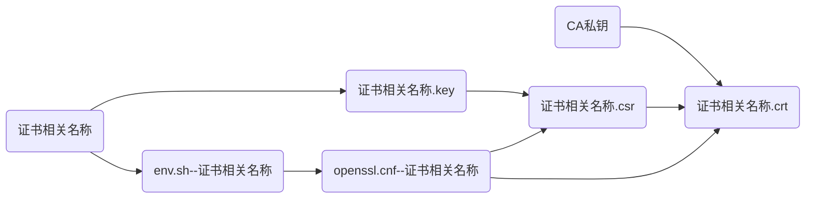
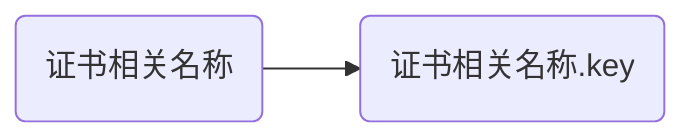
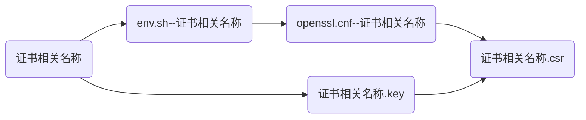
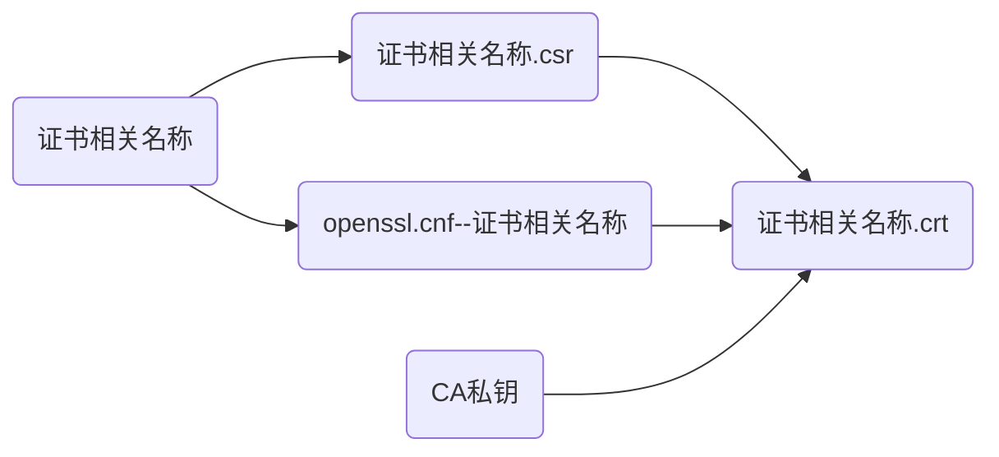
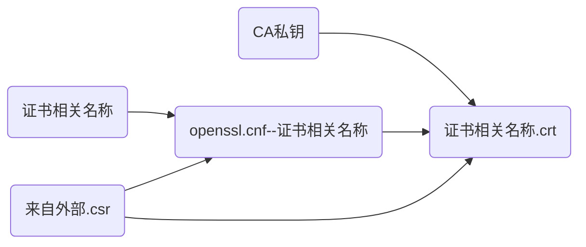

# zzxia-openssl-ca-server

中文名：猪猪侠之CA服务器 | [English](README_en.md)

**如果有使用上的问题或其他，可以加wx：`zzxia_ggbond` 解决。加好友时请注明你来自哪个平台！**


[toc]


## 1 介绍

基于openssl的CA证书服务器。你可以用它搭建自己的专属CA服务器，以方便为用户生成私钥、证书请求、颁发证书、吊销证书、证书续期、证书吊销列表等。它可以生成多种类型的证书，包括且不限于web服务器、代码、计算机、客户端、信任列表、时间戳、IPSec、Email、智能卡登陆及其他OID证书。只需简单在配置文件中指定即可，证书完全兼容与Windows、Linux、Android、iOS等PC及手机系统（自签名不兼容）。项目是产品化的，不用修改代码就可以管理CA服务器整个生命周期，计划未来增加web操作页面，实现用户从网页端申请、下载、续期等证书操作，以及证书吊销列表的分发。


### 1.1 背景

由于现在https的盛行，我们经常需要在内网服务器、手机、PC上使用证书（内网域名没法使用免费的Letsencrypt证书），但多数时候大家只会生成自签名证书，不会以CA的方式颁发证书，更不会让用户安装CA证书，造成用户在使用过程中总是提示不安全，浪费时间且体验非常糟糕，再者，颁发证书的相关信息从来不保存，不具延续性，不是正经人的做法，哈哈哈哈哈哈哈哈哈！

另外：OpenSSL证书相关知识还是有点复杂的（虽然一般用的很简单），特别是一些概念，很多人搞不清用途与区别，所以生成较为复杂的证书就会走一些弯路（有别于简单的自签名证书），希望这个可以帮到你。也可以帮到我自己，免得要用的时候又得折腾，因为长时间不用，容易遗忘，算是知识的固化吧。


### 1.2 功能

1. 初始化CA服务器
2. 一步生成CA服务器私钥及证书
3. 一步生成用户私钥及证书（三合一）
4. 分开步骤，分别为用户生成【私钥、证书请求、证书】
5. 为第三方证书请求颁发证书（支持外部CSR文件）
6. 为证书续期
7. 吊销证书
8. 生成CA证书吊销列表（CRL）


### 1.3 支持的证书类型

通过配置文件中的 `CERT_USE_FOR` 参数指定，支持以下 **10 种** 预定义证书类型：

| 编号 | 参数值      | 证书类型   | 密钥用法 (keyUsage) | 增强密钥用法 (extendedKeyUsage) |
| ---- | ----------- | ---------- | ------------------- | ------------------------------- |
| 1    | `ca`        | CA证书     | nonRepudiation, keyCertSign, cRLSign | - |
| 2    | `code`      | 代码签名   | digitalSignature | codeSigning |
| 3    | `computer`  | 计算机     | digitalSignature, keyAgreement | serverAuth |
| 4    | `webserver` | WEB服务器  | digitalSignature, nonRepudiation, keyEncipherment, dataEncipherment, keyAgreement | serverAuth |
| 5    | `client`    | 客户端     | digitalSignature, nonRepudiation, keyEncipherment, dataEncipherment | clientAuth |
| 6    | `trustlist` | 信任列表   | digitalSignature | msCTLSign |
| 7    | `timestamp` | 时间戳     | digitalSignature, nonRepudiation, keyEncipherment, dataEncipherment | timeStamping |
| 8    | `ipsec`     | IPSec      | digitalSignature, nonRepudiation, keyEncipherment, dataEncipherment | 1.3.6.1.5.5.8.2.2 |
| 9    | `email`     | 安全邮件   | digitalSignature, nonRepudiation, keyEncipherment, dataEncipherment | emailProtection |
| 10   | `smartcard` | 智能卡登录 | digitalSignature, keyAgreement, decipherOnly | msEFS, 1.3.6.1.4.1.311.20.2.2 |

> 如需增加自定义证书类型，请参考 `key_usage.md` 并修改 `function.sh` 中的 `F_CERT_USE_FOR_VAR` 函数。


### 1.4 喜欢她，就满足她：

1. 【Star】她，让她看到你是爱她的；
2. 【Watching】她，时刻感知她的动态；
3. 【Fork】她，为她增加新功能，修Bug，让她更加卡哇伊；
4. 【Issue】她，告诉她有哪些小脾气，她会改的，手动小绵羊；
5. 【打赏】她，为她买jk；


## 2 软件架构

Linux shell


### 2.1 设计理念

- 用Openssl搭建CA服务器
- **信任环境**：在CA服务器上为用户生成私钥与证书
- **非信任环境**：用户自己生成私钥与证书请求，将证书请求给到CA服务器，CA服务器根据用户提供的证书请求文件为用户生成证书（私钥一般是需要保密的，把自己假想成了NB的公共证书颁发者了）


### 2.2 脚本说明

| 脚本名称 | 用途 |
| -------- | ---- |
| `0-init_ca.sh` | 初始化CA服务器环境 |
| `1-generate_CA_key_and_crt.sh` | 生成CA服务器私钥与自签名证书 |
| `m-1-generate_user_key.sh` | 为用户生成私钥 |
| `m-2-generate_user_csr.sh` | 为用户生成证书请求（CSR） |
| `m-3-generate_user_crt.sh` | 为用户颁发证书（支持外部CSR） |
| `m-3in1-generate_user_key-csr-crt.sh` | 一键为用户生成私钥、CSR、证书 |
| `m-x-renew_user_crt.sh` | 证书续期（`m-3-generate_user_crt.sh` 的软链接） |
| `m-x-revoke_user_crt.sh` | 吊销用户证书 |
| `m-x-generate_CA_crl.sh` | 生成/更新CA证书吊销列表（CRL） |
| `function.sh` | 公共函数库（自动被各脚本加载） |
| `test_ca.sh` | 自动化测试脚本 |


### 2.3 目录结构

> 初始化后的目录结构：

```bash
$ tree
.
├── 0-init_ca.sh                          # 初始化CA
├── 1-generate_CA_key_and_crt.sh          # 生成CA密钥与证书
├── function.sh                           # 公共函数库
├── m-1-generate_user_key.sh              # 生成用户私钥
├── m-2-generate_user_csr.sh              # 生成用户证书请求
├── m-3-generate_user_crt.sh              # 颁发用户证书
├── m-3in1-generate_user_key-csr-crt.sh   # 一键生成
├── m-x-renew_user_crt.sh                 # 证书续期（软链接）
├── m-x-revoke_user_crt.sh               # 吊销证书
├── m-x-generate_CA_crl.sh               # 生成CRL
├── test_ca.sh                            # 自动化测试
├── key_usage.md                          # 密钥用法参考手册
├── my_conf/
│   ├── env.sh--CA.sample                 # CA配置示例
│   ├── env.sh--model                     # 用户证书配置模板
│   └── env.sh--test.lan                  # 用户证书配置示例
└── CA_data/                              # CA运行时数据目录（初始化后生成）
    ├── private/                          # CA私钥目录（权限700）
    ├── from_user_csr/                    # 用户私钥与CSR存放目录
    ├── to_user_crt/                      # 颁发的用户证书存放目录
    ├── newcerts/                         # CA颁发证书备份
    ├── certs/                            # 证书存放目录
    ├── crl/                              # CRL存放目录
    ├── ca.pem.crt                        # CA证书（PEM格式）
    ├── ca.der.crt                        # CA证书（DER格式）
    ├── index.txt                         # CA证书数据库
    ├── serial                            # 证书序列号（初始值01）
    └── crlnumber                         # CRL序列号（初始值01）
```


## 3 安装教程

### 3.1 环境要求

- 操作系统：Linux（在 Ubuntu、CentOS 7 上测试通过）
- 依赖软件：`openssl`（必须）、`bash`

### 3.2 安装

```bash
# 克隆仓库
git clone https://gitee.com/zhf_sy/zzxia-openssl-ca-server.git
cd zzxia-openssl-ca-server

# 确认openssl已安装
openssl version
```


## 4 使用说明

所有脚本都提供了 `-h|--help` 参数，查看帮助即可。


### 4.1 搭建CA

**第一步：初始化**

```bash
./0-init_ca.sh -y
```

**第二步：创建CA配置文件**

```bash
# 基于示例创建CA配置文件，根据自己的信息修改
cp ./my_conf/env.sh--CA.sample ./my_conf/env.sh--CA
vi ./my_conf/env.sh--CA
```

主要配置项：

| 变量 | 说明 | 示例 |
| ---- | ---- | ---- |
| `PRIVATEKEY_BITS` | 私钥长度 | `4096` |
| `CERT_BITS` | 证书长度 | `4096` |
| `CERT_DAYS` | 证书有效期（天） | `3650`（10年） |
| `CERT_MD` | 签名摘要算法 | `sha256` |
| `commonName_default` | CA通用名称 | `MY-ROOT-CA` |
| `CERT_USE_FOR` | 证书类型 | `1`（CA） |
| `alt_names` | 备用名称（SAN） | `DNS.1 = MY-ROOT-CA` |

**第三步：生成CA密钥与证书**

```bash
./1-generate_CA_key_and_crt.sh -y
```

> 生成过程中会以交互方式进行，根据提示填写CA相关信息即可。


### 4.2 日常使用（为用户生成私钥、证书请求、证书）

> 运行脚本前，请先查看帮助（`-h`），帮助中有相关脚本的依赖文件、参数说明及示例！
> 多数脚本须依赖基于 `./my_conf/env.sh--model` 创建的 `./my_conf/env.sh--证书相关名称` 环境变量文件，仓库中提供了一个示例（test.lan）`./my_conf/env.sh--test.lan` 供参考。

**准备工作：创建用户证书配置文件**

```bash
# 以 example.com 为例
cp ./my_conf/env.sh--model ./my_conf/env.sh--example.com
vi ./my_conf/env.sh--example.com
# 修改 commonName_default、alt_names、CERT_USE_FOR 等参数
```

#### 4.2.1 一步为用户生成私钥、证书请求、证书

>程序流程图：


```mermaid
graph LR;
0(CA私钥)
1(证书相关名称)
1-->4(证书相关名称.key)
1-->2(env.sh--证书相关名称)
2-->3(openssl.cnf--证书相关名称)
3-->5(证书相关名称.csr)
4-->5
5-->6(证书相关名称.crt)
3-->6
0-->6
```

>示例：

```bash
# 基本用法
./m-3in1-generate_user_key-csr-crt.sh  -n example.com

# 指定有效期730天、私钥4096位
./m-3in1-generate_user_key-csr-crt.sh  -n example.com  -p 4096  -d 730

# 静默模式（使用配置文件中的默认值，不提示交互）
./m-3in1-generate_user_key-csr-crt.sh  -n example.com  -q
```

| 参数 | 说明 | 默认值 |
| ---- | ---- | ------ |
| `-n\|--name` | 证书相关名称（**必填**） | - |
| `-p\|--privatekey-bits` | 私钥长度 | 2048 |
| `-c\|--cert-bits` | 证书长度 | 2048 |
| `-d\|--days` | 证书有效天数 | 365 |
| `-q\|--quiet` | 静默模式 | - |


#### 4.2.2 分步骤为用户生成私钥、证书请求、证书

**1. 生成私钥：**

```bash
./m-1-generate_user_key.sh  -n example.com
# 指定私钥长度4096位
./m-1-generate_user_key.sh  -n example.com  -p 4096
```

>程序流程图：


```mermaid
graph LR;
1(证书相关名称)
1-->4(证书相关名称.key)
```


**2. 生成证书请求：**

```bash
./m-2-generate_user_csr.sh  -n example.com
# 静默模式
./m-2-generate_user_csr.sh  -n example.com -q
```

>程序流程图：


```mermaid
graph LR;
1(证书相关名称)
1-->2(env.sh--证书相关名称)
2-->3(openssl.cnf--证书相关名称)
3-->5(证书相关名称.csr)
1-->4(证书相关名称.key)
4-->5
```


**3. 颁发证书：**

```bash
# 使用本系统生成的CSR
./m-3-generate_user_crt.sh  -n example.com

# 指定有效期和证书长度
./m-3-generate_user_crt.sh  -n example.com  -c 4096  -d 730

# 使用第三方CSR文件
./m-3-generate_user_crt.sh  -f /path/to/xxx.csr  -n example.com
```

>程序流程图（使用本系统CSR）：


```mermaid
graph LR;
0(CA私钥)
1(证书相关名称)
1-->3(openssl.cnf--证书相关名称)
1-->5(证书相关名称.csr)
5-->6(证书相关名称.crt)
3-->6
0-->6
```

>程序流程图（使用外部CSR）：


```mermaid
graph LR;
0(CA私钥)
1(证书相关名称)
1-->3(openssl.cnf--证书相关名称)
5(来自外部.csr)-->3
5-->6(证书相关名称.crt)
3-->6
0-->6
```

> 如果曾经颁发的证书过期了，只需再次运行`m-3-generate_user_crt.sh`就可以了，为了便于用户理解，增加了个软连接名称`m-x-renew_user_crt.sh`。


### 4.3 其他使用


#### 4.3.1 更新（renew）用户证书

等同【4.2.2 - 3】为用户生成证书，请参考。

```bash
./m-x-renew_user_crt.sh  -n example.com
```


#### 4.3.2 吊销（revoke）用户证书

```bash
./m-x-revoke_user_crt.sh  -n example.com
```

> 吊销后请记得更新CRL吊销列表！


#### 4.3.3 生成CA证书吊销列表（CRL）

```bash
./m-x-generate_CA_crl.sh  -y
```

> 吊销证书后务必运行此命令更新CRL，以便客户端能够感知到证书已被吊销。


## 5 配置文件说明

配置文件存放在 `my_conf/` 目录下。

### 5.1 模板文件

| 文件 | 说明 |
| ---- | ---- |
| `env.sh--CA.sample` | CA证书配置示例，使用前复制为 `env.sh--CA` |
| `env.sh--model` | 用户证书配置模板，创建新用户证书时基于此模板复制 |
| `env.sh--test.lan` | 用户证书配置示例（test.lan） |

### 5.2 主要配置参数

```bash
## 私钥
export PRIVATEKEY_BITS=${PRIVATEKEY_BITS:-2048}    # 私钥长度

## 证书
export CERT_BITS=${CERT_BITS:-2048}                # 证书长度
export CERT_DAYS=${CERT_DAYS:-365}                 # 证书有效期（天）
export CERT_MD=${CERT_MD:-sha256}                  # 签名摘要算法

## 用户信息
export countryName_default="CN"                    # 国家
export stateOrProvinceName_default="GuangDong"     # 省份
export localityName_default="GuangZhou"            # 城市
export organizationName_default0="ZZXia"           # 组织
export organizationalUnitName_default="IT"         # 部门
export emailAddress_default="admin@test.lan"       # 邮箱
export commonName_default="test.lan"               # 通用名称（CN）

## 备用名称（SAN）
export alt_names=$(echo "
DNS.1 = test.lan
DNS.2 = *.test.lan
IP.1 = 192.168.1.1
")

## 证书类型（参考 1.3 支持的证书类型）
export CERT_USE_FOR='4'    # 4=webserver
```


## 6 测试

项目包含自动化测试脚本，覆盖 CA 全生命周期：

```bash
bash test_ca.sh
```

测试内容包括：
- `F_CERT_USE_FOR_VAR` 函数的 10 种证书类型校验
- CA 初始化
- CA 密钥与证书生成
- 用户密钥生成
- 用户 CSR 生成
- 用户证书颁发与 CA 验证
- 一键生成（三合一）
- 证书吊销
- CRL 生成

> 测试在临时目录中运行，不影响项目数据。


## 7 Openssl知识

### 7.1 常用命令

| 命令 | 用途 | 典型使用场景 |
| ---- | ---- | ------------ |
| `openssl genrsa` | 生成 RSA 私钥 | 为 CA 或用户生成私钥文件（`.key`） |
| `openssl req` | 生成证书请求（CSR）或自签名证书 | 基于私钥生成 CSR 文件（`.csr`），交互式或静默式填写主题信息 |
| `openssl ca` | 以 CA 身份签发/吊销证书 | CA 根据 CSR 签发证书，记录到 `index.txt` 数据库，管理序列号 |
| `openssl x509` | 证书格式转换、查看、自签名 | CA 自签名证书生成（`-req -signkey`）、PEM↔DER 格式转换、查看证书详情 |
| `openssl crl` | CRL 格式转换与查看 | PEM↔DER 格式转换、查看吊销列表详情 |
| `openssl verify` | 验证证书链 | 验证用户证书是否由指定 CA 签发（`-CAfile`） |

> **`openssl ca` vs `openssl x509` 签发区别**：
> - `openssl ca`：完整的 CA 流程，会更新 `index.txt` 数据库和 `serial` 序列号，支持吊销管理
> - `openssl x509 -req -signkey`：简单的自签名，不经过 CA 数据库，仅用于根 CA 自签名证书（两步：先 `req` 生成 CSR，再 `x509` 自签名）
> - `openssl req -new -x509`：一步完成自签名证书生成（省去 CSR 中间步骤），效果等同上面两步，但更简洁

### 7.2 证书扩展段（Extensions Section）

本项目的 `openssl.cnf` 中定义了以下扩展段，用于不同类型的证书签发：

| 扩展段 | 用途 | basicConstraints | subjectKeyIdentifier | authorityKeyIdentifier | subjectAltName |
| ------ | ---- | --------------- | -------------------- | ---------------------- | -------------- |
| `v3_req` | **CSR 生成**（`openssl req` 的 `req_extensions`） | `CA:FALSE` | ✅ `hash` | ❌ 不可包含（CSR 阶段无签发者） | ✅ `@alt_names` |
| `usr_cert` | **终端证书签发**（`openssl ca` 的 `-extensions`） | `CA:FALSE` | ✅ `hash` | ✅ `keyid,issuer` | ✅ `@alt_names` |
| `v3_ca` | **CA/sub-CA 证书签发**（`openssl ca` 或 `openssl x509` 的 `-extensions`） | `CA:true` | ✅ `hash` | ✅ `keyid:always,issuer`（严格模式） | ✅ `@alt_names` |

> **为什么 `v3_req` 不能包含 `authorityKeyIdentifier`？**
> 因为 `v3_req` 同时被 `openssl req` 用作 `req_extensions`。生成 CSR 时还没有签发者证书，如果包含 `authorityKeyIdentifier` 会导致 OpenSSL 报错。
>
> **`keyid` vs `keyid:always` 的区别：**
> - `keyid`：尝试从签发者证书复制 SKI，失败时静默跳过（适合终端证书）
> - `keyid:always`：失败时报错，确保证书链完整性（适合 CA 证书）


## 8 参与贡献

1.  Fork 本仓库
2.  新建 Feat_xxx 分支
3.  提交代码
4.  新建 Pull Request
