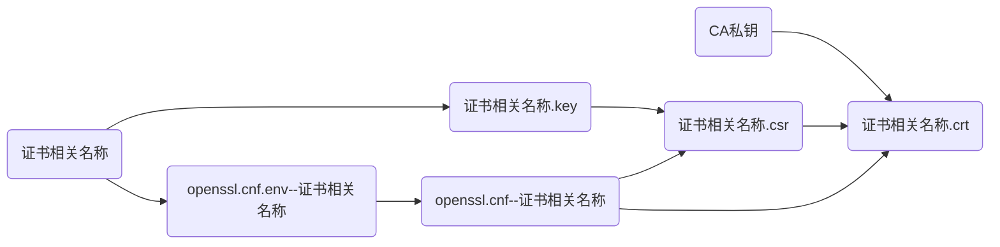
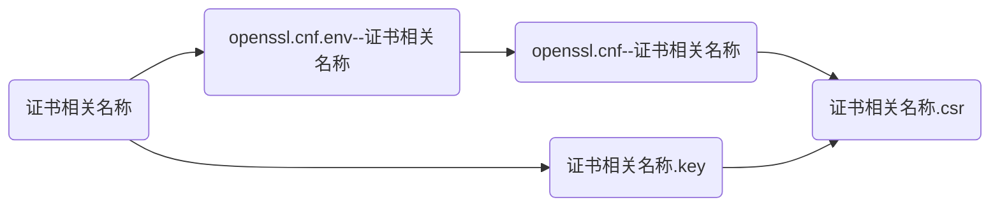

# zzxia-openssl-ca-server

## 1 介绍
这是基于openssl的CA服务器。你可以用它秒建自己的专属CA服务器，以方便为用户生成私钥、颁发证书、吊销证书、证书续期。


### 1.1 背景

由于Https的盛行，我们经常需要在内网服务器上使用证书（内网域名没法使用外网免费Letsencrypt证书），虽然使用Openssl颁发证书很简单，但其实很多人并不清楚其中原理，只是简单的拷贝、粘贴、运行，在需要证书时，临时生成一个，更不会让用户安装CA证书，造成用户在使用过程中总是要忍受证书的不安全提示，这种体验非常糟糕，再者，颁发证书的相关信息从来不保存，不具延续性，不是正经人的做法，哈哈哈哈哈哈哈哈哈！


### 1.2 功能

1. 初始化CA服务器
2. 一步生成CA服务器私钥及证书
3. 一步生成用户私钥及证书
4. 分开步骤，分别为用户生成【私钥、证书请求、证书】
5. 为第三方证书请求颁发证书
6. 为证书续期
7. 吊销证书


### 1.3 喜欢她，就满足她：

1. 【Star】她，让她看到你是爱她的；
2. 【Watching】她，时刻感知她的动态；
3. 【Fork】她，为她增加新功能，修Bug，让她更加卡哇伊；
4. 【Issue】她，告诉她有哪些小脾气，她会改的，手动小绵羊；
5. 【打赏】她，为她买jk；


## 2 软件架构

Linux shell


### 2.1 设计理念

- 用Openssl搭建CA服务器
- 信任环境：在CA服务器上为用户生成私钥与证书
- 非信任环境：用户自己生成私钥与证书请求，将证书请求给到CA服务器，CA服务器根据用户提供的证书请求文件为用户生成证书（私钥一般是需要保密的，把自己假想成了NB的公共证书颁发者了）


### 2.2 目录结构

> 初始化后的目录结构：

```bash
$ tree
.
├── 0-init_ca.sh
├── 1-generate_CA_key_and_crt.sh
├── certs
├── crl
├── crlnumber
├── env_and_function.sh
├── from_user_csr
├── index.txt
├── LICENSE
├── m-1-generate_user_key.sh
├── m-2-generate_user_csr.sh
├── m-3-generate_user_crt.sh
├── m-3in1-generate_user_key-csr-crt.sh
├── my_conf
│   ├── openssl.cnf.env---model
│   └── openssl.cnf.env---test.lan
├── newcerts
├── private
├── README.md
├── serial
└── to_user_crt

7 directories, 14 files
```


## 3 安装教程

克隆到服务器上即可。
需要安装Linux 软件包`expect`。
在ubuntu上测试通过，理论上只要是基于Linux内核都行


## 4 使用说明
所有命令都提供了`$0 -h|--help`参数，查看帮助即可。


### 4.1 搭建CA
1. 运行`./0-init_ca.sh`进行初始化
2. 运行`1-generate_CA_key_and_crt.sh`以生成CA服务器私钥与自签名证书
> 以上根据自己的信息填写即可


### 4.2 后续使用（即为用户生成私钥、证书请求、证书）

在运行证书请求与颁发证书前，请先查看命令帮助，帮助中有相关命令的依赖文件、参数说明及示例！
多数命令须先创建基于`./my_conf/openssl.cnf.env---model`创建`./my_conf/openssl.cnf.env---证书相关名称`文件，仓库中提供了一个示例（test.lan）`./my_conf/openssl.cnf.env---test.lan`供参考。


#### 4.2.1 一步为用户生成私钥、证书请求、证书

>程序流程图：

>帮助：
```bash
$ ./m-3in1-generate_user_key-csr-crt.sh -h

    用途：用于生成用户秘钥与证书
    依赖：
        ./env_and_function.sh
        ./my_conf/openssl.cnf.env---${NAME}      #--- 此文件须自行基于【./my_conf/openssl.cnf.env---model】创建
    注意：
    用法:
        ./m-3in1-generate_user_key-csr-crt.sh  [-h|--help]
        ./m-3in1-generate_user_key-csr-crt.sh  [-n|--name {证书名称}]  <-p|--privatekey-bits {私钥长度}>  <-c|--cert-bits {证书长度}>  <-d|--days {证书有效天数}>  <-q|--quiet>
    参数说明：
        $0   : 代表脚本本身
        []   : 代表是必选项
        <>   : 代表是可选项
        |    : 代表左右选其一
        {}   : 代表参数值，请替换为具体参数值
        %    : 代表通配符，非精确值，可以被包含
        #
        -h|--help      此帮助
        -n|--name      指定名称，用以确定用户证书相关名称前缀及env、cnf文件名称后缀。
                       即：【私钥、证书请求、证书】的文件名称前缀：test.com.key、test.com.csr、test.com.crt
                           【环境变量、配置】文件名的后缀：openssl.cnf.env---test.com、openssl.cnf---test.com
        -p|--privatekey-bits  私钥长度，默认2048
        -c|--cert-bits 证书长度，默认2048
        -d|--days      证书有效期，默认365天
        -q|--quiet     静默方式运行
    示例:
        ./m-3in1-generate_user_key-csr-crt.sh  -n test.com
        #
        ./m-3in1-generate_user_key-csr-crt.sh  -n test.com  -d 730
        ./m-3in1-generate_user_key-csr-crt.sh  -n test.com  -p 4096
        ./m-3in1-generate_user_key-csr-crt.sh  -n test.com  -p 4096  -c 2048  -d 730
        ./m-3in1-generate_user_key-csr-crt.sh  -n test.com  -q
```


#### 4.2.2 分别为用户生成私钥、证书请求、证书

1. 生成私钥：
>程序流程图：

>帮助：
```bash
$ ./m-1-generate_user_key.sh -h

    用途：用于生成用户秘钥
    依赖：
        ./env_and_function.sh
    注意：
    用法:
        ./m-1-generate_user_key.sh  [-h|--help]
        ./m-1-generate_user_key.sh  [-n|--name {证书相关名称}]  <-p|--privatekey-bits {私钥长度}>  <-q|--quiet>
    参数说明：
        $0   : 代表脚本本身
        []   : 代表是必选项
        <>   : 代表是可选项
        |    : 代表左右选其一
        {}   : 代表参数值，请替换为具体参数值
        %    : 代表通配符，非精确值，可以被包含
        #
        -h|--help      此帮助
        -n|--name      指定名称，用以确定用户证书相关名称前缀及env、cnf文件名称后缀。
                       即：【私钥、证书请求、证书】的文件名称前缀：test.com.key、test.com.csr、test.com.crt
                           【环境变量、配置】文件名的后缀：openssl.cnf.env---test.com、openssl.cnf---test.com
        -p|--privatekey-bits  私钥长度，默认2048
        -q|--quiet     静默方式运行
    示例:
        ./m-1-generate_user_key.sh  -n test.com
        ./m-1-generate_user_key.sh  -p 4096  -n test.com
        ./m-1-generate_user_key.sh  -q  -n test.com
```

2. 生成证书请求：
>程序流程图：

>帮助：
```bash
$ ./m-2-generate_user_csr.sh -h

    用途：用于生成用户秘钥与证书
    依赖：
        ./env_and_function.sh
        ./my_conf/openssl.cnf.env---${NAME}      #--- 此文件须自行基于【./my_conf/openssl.cnf.env---model】创建
    注意：
    用法:
        ./m-2-generate_user_csr.sh  [-h|--help]
        ./m-2-generate_user_csr.sh  [-n|--name {证书相关名称}]  <-q|--quiet>
    参数说明：
        $0   : 代表脚本本身
        []   : 代表是必选项
        <>   : 代表是可选项
        |    : 代表左右选其一
        {}   : 代表参数值，请替换为具体参数值
        %    : 代表通配符，非精确值，可以被包含
        #
        -h|--help      此帮助
        -n|--name      指定名称，用以确定用户证书相关名称前缀及env、cnf文件名称后缀。
                       即：【私钥、证书请求、证书】的文件名称前缀：test.com.key、test.com.csr、test.com.crt
                           【环境变量、配置】文件名的后缀：openssl.cnf.env---test.com、openssl.cnf---test.com
        -q|--quiet     静默方式运行
    示例:
        ./m-2-generate_user_csr.sh  -n test.com
        ./m-2-generate_user_csr.sh  -n test.com -q
```

3. 颁发证书（证书第一次颁发、证书续期重新颁发）：
>程序流程图：

或者：


>帮助：
```bash
$ ./m-3-generate_user_crt.sh -h

    用途：用于颁发用户证书
    依赖：
        ./env_and_function.sh
        ./my_conf/openssl.cnf.env---${NAME}      #--- 此文件须自行基于【./my_conf/openssl.cnf.env---model】创建
    注意：
    用法:
        ./m-3-generate_user_crt.sh  [-h|--help]
        ./m-3-generate_user_crt.sh  [-n|--name {证书相关名称}]  <-c|--cert-bits {证书长度}>  <-d|--days {证书有效天数}>  <-f|--csr-file {证书请求文件}>  <-q|--quiet>
    参数说明：
        $0   : 代表脚本本身
        []   : 代表是必选项
        <>   : 代表是可选项
        |    : 代表左右选其一
        {}   : 代表参数值，请替换为具体参数值
        %    : 代表通配符，非精确值，可以被包含
        #
        -h|--help      此帮助
        -n|--name      指定名称，用以确定用户证书相关名称前缀及env、cnf文件名称后缀。
                       即：【私钥、证书请求、证书】的文件名称前缀：test.com.key、test.com.csr、test.com.crt
                           【环境变量、配置】文件名的后缀：openssl.cnf.env---test.com、openssl.cnf---test.com
        -f|--csr-file  指定外部用户证书请求文件。一般只有在用户使用其他工具生成证书请求时使用此项
        -c|--cert-bits 证书长度，默认2048
        -d|--days      证书有效期，默认365天
        -q|--quiet     静默方式运行
    示例:
        ./m-3-generate_user_crt.sh  -n test.com
        #
        ./m-3-generate_user_crt.sh  -c 4096  -n test.com
        ./m-3-generate_user_crt.sh  -d 730   -n test.com
        ./m-3-generate_user_crt.sh  -c 4096  -d 730  -n test.com
        # 第三方证书请求
        ./m-3-generate_user_crt.sh  -f /path/to/xxx.csr  -n xxxxx
        ./m-3-generate_user_crt.sh  -c 4096  -d 730  -f /path/to/xxx.csr  -n xxxxx
```
> 如果曾经颁发的证书过期了，只需再次运行`m-3-generate_user_crt.sh`就可以了。


## 5 参与贡献

1.  Fork 本仓库
2.  新建 Feat_xxx 分支
3.  提交代码
4.  新建 Pull Request


## 6 特技

1.  使用 Readme\_XXX.md 来支持不同的语言，例如 Readme\_en.md, Readme\_zh.md
2.  Gitee 官方博客 [blog.gitee.com](https://blog.gitee.com)
3.  你可以 [https://gitee.com/explore](https://gitee.com/explore) 这个地址来了解 Gitee 上的优秀开源项目
4.  [GVP](https://gitee.com/gvp) 全称是 Gitee 最有价值开源项目，是综合评定出的优秀开源项目
5.  Gitee 官方提供的使用手册 [https://gitee.com/help](https://gitee.com/help)
6.  Gitee 封面人物是一档用来展示 Gitee 会员风采的栏目 [https://gitee.com/gitee-stars/](https://gitee.com/gitee-stars/)


