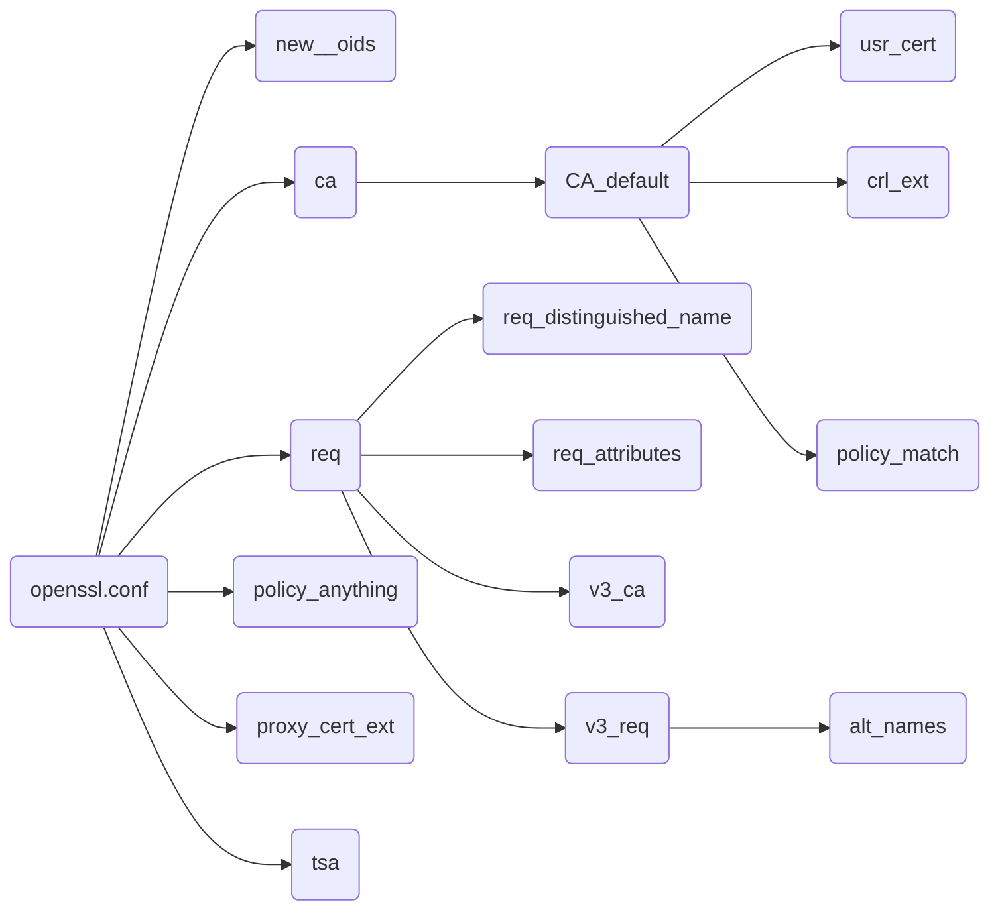

# 自建CA及证书颁发(openssl)
[TOC]


## 1 搭建CA

### 1.1 建立CA目录与文件
基于默认配置文件(openssl.conf)有稍作改动以便于使用

目录结构：
```text
kevin@kevin-TM1701:~/gaoshi/zzxia-CA-openssl$ tree
.
├── ca.pem.crt
├── ca.pem.csr
├── certs
├── crl
├── crlnumber
├── from_user_csr
│   ├── c919.lan.csr
│   ├── c919.lan.key
│   ├── zjlh.lan.csr
│   └── zjlh.lan.key
├── index.txt
├── index.txt.attr
├── index.txt.attr.old
├── index.txt.old
├── newcerts
│   ├── 01.pem
│   └── 02.pem
├── openssl.cnf---c919.lan
├── openssl.cnf---zjlh.lan
├── private
│   └── ca.pem.key
├── readme.md
├── serial
├── serial.old
├── my_conf
└── to_user_crt
    ├── c919.lan.crt
    └── zjlh.lan.crt

6 directories, 21 files
```
以下目录都是为了方便CA为用户颁发证书而建立：
```text
* from_user_csr：用以存放用户的证书请求文件，
* to_user_crt  ：用以存放CA为用户颁发的证书文件，另外：newcerts(新的)及certs（曾经的）也是存放CA颁发的用户证书路径
```
其他目录都是依据openssl.conf创建：
```text
* private    ：存放ca的秘钥ca.pem.key的目录与文件名
* ca.pem.crt ：ca证书
* index.txt  ：ca数据库，初始值为空
* serial     ：下一个证书的编号，初始为两位数，比如：01
* crlnumber  ：下一个吊销证书的编号，初始为两位数，比如：01
* newcerts   ：新颁发的证书
* certs      ：用来保存的已颁发证书
* crl.pem    ：CA吊销证书
* crl        ：用来保持的已吊销证书
```

```bash
touch index.txt
echo '01'  > serial
echo '01'  > crlnumber
```

### 1.2 生成CA私钥及证书
```
openssl genrsa -out private/ca.pem.key 4096
openssl req -new  -key private/ca.pem.key  -out ca.pem.csr
openssl x509 -days 3650 -req  -in ca.pem.csr  -signkey private/ca.pem.key  -out ca.pem.crt
```
* 自签名证书无法使用配置文件，CA服务器证书也是自签名证书，所以也不能使用配置文件
* 生成的证书都是pem格式的，文件名是ca.pem.crt或者ca.crt都无所谓


### 1.3 证书颁发之配置文件准备openssl.cnf
确认配置文件中ca相关信息(CA_default节)的正确
配置用户证书请求与CA颁发中用到的信息：用户信息(req_distinguished_name节)、通用名称(commonName)、备用名称(alt_names节)
openssl.cnf用途：
* 用户在生成证书请求时会用到以上信息(用户信息、通用名称、备用名称)
* CA服务器在颁发证书时会用到以上信息及CA相关信息

openssl.cnf文件中配置关系图：



## 2 颁发证书

### 2.1 用户自己生成秘钥与证书请求（可以在自己的PC上完成）
```
# 生成秘钥（秘钥中包含私钥和公钥）
openssl genrsa -out from_user_csr/docker-repo.key 2048  

# 用户生成证书请求，如果需要备用名，需要使用openssl.cnf
openssl req -new -key from_user_csr/docker-repo.key  -out from_user_csr/docker-repo.csr -config  openssl.cnf 
# 查看证书请求内容
openssl req -in from_user_csr/docker-repo.csr -noout -text
```


### 2.2 CA服务器颁发证书
```
# 将证书请求文件cp到服务器上，比如：from_user_csr/docker-repo.csr
# 如果需要备用名，需要编辑openssl.cnf（服务器上）
# 颁发：
#openssl ca -in from_user_csr/docker-repo.csr -out to_user_crt/docker-repo.crt -cert ca.crt -keyfile ca.key -extensions v3_req -config openssl.cnf 
# 省略ca相关文件，因为openssl.cnf中已经定义：
openssl ca -in from_user_csr/docker-repo.csr -out to_user_crt/docker-repo.crt -extensions v3_req -config openssl.cnf 

# 查看办法的证书内容：
openssl x509 -in to_user_crt/docker-repo.crt -noout -text
```

### 2.3 变量方式方便点：
```bash
DOMAIN='zjlh.lan'
openssl genrsa -out from_user_csr/${DOMAIN}.key  2048
openssl req -new  -key from_user_csr/${DOMAIN}.key  -out from_user_csr/${DOMAIN}.csr -config  openssl.cnf---${DOMAIN}
openssl req  -in from_user_csr/${DOMAIN}.csr  -noout -text
openssl ca  -in from_user_csr/${DOMAIN}.csr  -out to_user_crt/${DOMAIN}.crt  -extensions v3_req  -config openssl.cnf---${DOMAIN}
openssl x509  -in to_user_crt/${DOMAIN}.crt  -noout -text
```


### 2.4 例子
```bash
kevin@kevin-TM1701:~/gaoshi/zzxia-CA-openssl$ DOMAIN='zjlh.lan'
kevin@kevin-TM1701:~/gaoshi/zzxia-CA-openssl$ openssl genrsa -out from_user_csr/${DOMAIN}.key  2048
Generating RSA private key, 2048 bit long modulus
..........................................................................+++
..................+++
e is 65537 (0x10001)
kevin@kevin-TM1701:~/gaoshi/zzxia-CA-openssl$ 
kevin@kevin-TM1701:~/gaoshi/zzxia-CA-openssl$ openssl req -new  -key from_user_csr/${DOMAIN}.key  -out from_user_csr/${DOMAIN}.csr -config  openssl.cnf---${DOMAIN}
You are about to be asked to enter information that will be incorporated
into your certificate request.
What you are about to enter is what is called a Distinguished Name or a DN.
There are quite a few fields but you can leave some blank
For some fields there will be a default value,
If you enter '.', the field will be left blank.
-----
Country Name (2 letter code) [CN]:
State or Province Name (full name) [GuangDong]:
Locality Name (eg, city) [GuangZhou]:
Organization Name (eg, company) [ZJLH]:
Organizational Unit Name (eg, section) [IT]:
Common Name (eg, your name or your server's hostname) [zjlh.lan]:
Email Address [admin@zjlh.lan]:

Please enter the following 'extra' attributes
to be sent with your certificate request
A challenge password []:
An optional company name []:
kevin@kevin-TM1701:~/gaoshi/zzxia-CA-openssl$ 
kevin@kevin-TM1701:~/gaoshi/zzxia-CA-openssl$ openssl ca  -in from_user_csr/${DOMAIN}.csr  -out to_user_crt/${DOMAIN}.crt  -extensions v3_req  -config openssl.cnf---${DOMAIN}
Using configuration from openssl.cnf---zjlh.lan
Check that the request matches the signature
Signature ok
Certificate Details:
        Serial Number: 1 (0x1)
        Validity
            Not Before: Sep 26 05:41:47 2020 GMT
            Not After : Sep 26 05:41:47 2021 GMT
        Subject:
            countryName               = CN
            stateOrProvinceName       = GuangDong
            organizationName          = ZJLH
            organizationalUnitName    = IT
            commonName                = zjlh.lan
            emailAddress              = admin@zjlh.lan
        X509v3 extensions:
            X509v3 Basic Constraints: 
                CA:FALSE
            X509v3 Key Usage: 
                Digital Signature, Non Repudiation, Key Encipherment
            X509v3 Subject Alternative Name: 
                DNS:zjlh.lan, DNS:*.zjlh.lan, DNS:docker-repo
Certificate is to be certified until Sep 26 05:41:47 2021 GMT (365 days)
Sign the certificate? [y/n]:y


1 out of 1 certificate requests certified, commit? [y/n]y
Write out database with 1 new entries
Data Base Updated
kevin@kevin-TM1701:~/gaoshi/zzxia-CA-openssl$ 
kevin@kevin-TM1701:~/gaoshi/zzxia-CA-openssl$ openssl x509  -in to_user_crt/${DOMAIN}.crt  -noout -text
Certificate:
    Data:
        Version: 3 (0x2)
        Serial Number: 1 (0x1)
    Signature Algorithm: sha256WithRSAEncryption
        Issuer: C=CN, ST=GuangDong, L=GuangZhou, O=\xC3\xA7\xC2\x8C\xC2\xAA\xC3\xA7\xC2\x8C\xC2\xAA\xC3\xA4\xC2\xBE\xC2\xA0\xC3\xA9\xC2\x9B\xC2\x86\xC3\xA5\xC2\x9B\xC2\xA2, OU=IT, CN=zzxia-root-CA/emailAddress=kevinzu007@zzxia.vip
        Validity
            Not Before: Sep 26 05:41:47 2020 GMT
            Not After : Sep 26 05:41:47 2021 GMT
        Subject: C=CN, ST=GuangDong, O=ZJLH, OU=IT, CN=zjlh.lan/emailAddress=admin@zjlh.lan
        Subject Public Key Info:
            Public Key Algorithm: rsaEncryption
                Public-Key: (2048 bit)
                Modulus:
                    00:c8:a0:a8:ea:33:87:98:22:c2:83:ba:7e:a3:4b:
                    4e:b8:38:cb:21:32:fd:06:41:8d:2e:e9:2f:19:35:
                    ......
                    fa:83:04:62:26:09:03:64:fc:0b:57:aa:36:ad:00:
                    3e:7d:08:cb:11:f2:c7:68:74:a7:78:aa:47:76:4f:
                    60:33
                Exponent: 65537 (0x10001)
        X509v3 extensions:
            X509v3 Basic Constraints: 
                CA:FALSE
            X509v3 Key Usage: 
                Digital Signature, Non Repudiation, Key Encipherment
            X509v3 Subject Alternative Name: 
                DNS:zjlh.lan, DNS:*.zjlh.lan, DNS:docker-repo
    Signature Algorithm: sha256WithRSAEncryption
         84:e1:d8:36:41:f7:b8:4f:3a:a1:e6:18:2a:50:8e:0b:24:7d:
         9a:f6:7e:8d:ed:93:44:7a:d3:26:23:9d:36:f0:4f:d1:bb:ee:
         ......
         86:32:9e:88:fd:a9:5d:cc:e9:3c:55:be:e6:d9:9c:ae:fd:51:
         38:da:ab:c2:4f:b9:d0:8f:df:49:89:94:03:f6:8e:45:64:9d:
         e9:93:75:4a:0a:29:45:96
```


### 2.5 错误：
```bash
[root@localhost CA]# openssl ca -in server.csr -out server.crt
Using configuration from ./openssl.cnf
Check that the request matches the signature
Signature ok
The organizationName field needed to be the same in the
CA certificate (ZZXIA) and the request (ZJLH)
```
如果出现了以上错误，则请修改openssl.cnf中"[ policy_match ]"里的项：
```conf
#如果值为"match"，则客户端证书请求时，相应信息必须和CA证书保持一致；反之如果为"optional"，则不用
#countryName    = match
countryName     = optional
#stateOrProvinceName    = match
stateOrProvinceName = optional
#organizationName   = match
organizationName    = optional
organizationalUnitName  = optional
commonName      = supplied
emailAddress        = optional
```


### 2.6 v3扩展说明
一般用来增加证书备用名称

#### 证书请求中添加v3扩展：
在openssl.cnf中开启 req_extensions = v3_req，添加备用名称则修改[ alt_names ]节

#### 在CA证书颁发时启用v3扩展
命令行增加 "-extensions v3_req" 及[ alt_names ]节

#### 总结
1. 不管证书请求中是否有v3扩展，都可以在证书颁发时添加扩展：命令行添加 "-extensions v3_req"，并在openssl.cnf中，"req_extensions = v3_req"及[ alt_names ]下的内容；
1. 不管证书请求中是否有v3扩展，可以在证书颁发时关闭扩展：去掉扩展命令即可 "-extensions v3_req"；
1. 颁发出来的证书有没有扩展与证书请求无关，与命令行是否添加 "-extensions v3_req"有关；
1. 证书扩展的备用名称与证书请求也是无关的，因为证书颁发最终使用的备用名称是ca上openssl.cnf中[ alt_names ]下的内容；
1. 也就是证书请求时v3扩展的备用名称只有提示用途，最终证书中的备用名称只与ca上openssl.cnf中[ alt_names ]下的内容相关；

#### 另：
增加备用名称，请修改以下内容：
```
[ alt_names ]
# commonName值必须也出现在alt_names备用名称列表中
DNS.1 = zjlh.lan
DNS.2 = *.zjlh.lan
#DNS.n = zzxia.vip
```


## 3 吊销证书
```
# 查询需要吊销证书信息
#openssl x509 -in newcerts/03.pem -noout -serial -subject
openssl x509 -in to_user_crt/docker-repo.crt -noout -serial -subject
# 吊销
openssl ca -revoke newcerts/03.pem  -config openssl.cnf
```


## 4 更新吊销证书列表
```
#openssl ca -gencrl   -config openssl.cnf    #---为什么没有根据openssl.cnf更新crl.pem
openssl ca -gencrl -out crl.pem  -config openssl.cnf
# 查看
openssl crl -in crl.pem -noout -text
```


## 5 客户端安装ca证书
```
# ubuntu
#sudo  cp gc-ca.crt  /usr/local/share/ca-certificates/
sudo  cp gc-ca.pem.crt  /usr/local/share/ca-certificates/
sudo update-ca-certificates

# centos
cp gc-ca.crt /etc/pki/ca-trust/source/anchors/
update-ca-trust
```


## 6 自签名证书和私有CA签名的证书的区别
自签名的证书无法被吊销，CA签名的证书可以被吊销 能不能吊销证书的区别在于，如果你的私钥被黑客获取，如果证书不能被吊销，则黑客可以伪装成你与用户进行通信
如果你的规划需要创建多个证书，那么使用私有CA的方法比较合适，因为只要给所有的客户端都安装了CA的证书，那么以该证书签名过的证书，客户端都是信任的，也就是安装一次就够了
如果你直接用自签名证书，你需要给所有的客户端安装该证书才会被信任，如果你需要第二个证书，则还的挨个给所有的客户端安装证书2才会被信任。


## 7 good
参考：https://blog.csdn.net/u014721096/article/details/78571287


## 8 openssl.cnf：
```conf
openssl.cnf
```
